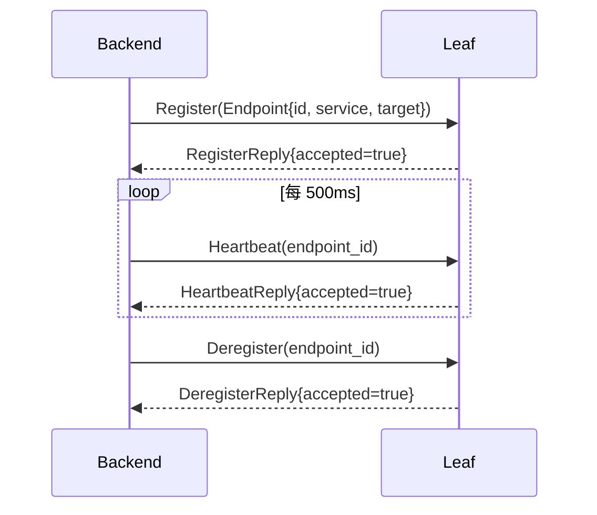

# Creek API 参考

## 1. gRPC 服务定义

所有 gRPC 服务定义在 `proto/creek.proto` 中，包名 `creek.v1`。

### 1.1 Greeter Service

客户端入口服务，由 Leaf 暴露。

```protobuf
service Greeter {
  rpc SayHello(HelloRequest) returns (HelloReply);
}

message HelloRequest {
  string name = 1;    // 请求名称
  string sid = 2;     // 会话 ID（用于粘性路由）
  bool sticky = 3;    // 是否启用粘性路由
}

message HelloReply {
  string message = 1;     // 响应消息
  string backend_id = 2;  // 处理请求的 Backend ID
}
```

**调用示例**（gRPC C++）：

```cpp
auto channel = grpc::CreateChannel("127.0.0.1:9000",
    grpc::InsecureChannelCredentials());
auto stub = creek::v1::Greeter::NewStub(channel);

creek::v1::HelloRequest request;
request.set_name("world");
request.set_sid("session-1");
request.set_sticky(true);

creek::v1::HelloReply reply;
grpc::ClientContext context;
context.AddMetadata("sticky", "true");
context.AddMetadata("sid", "session-1");

grpc::Status status = stub->SayHello(&context, request, &reply);
```

### 1.2 LeafControl Service

Backend 管理与注册服务，由 Leaf 暴露。

```protobuf
service LeafControl {
  rpc Register(RegisterRequest) returns (RegisterReply);
  rpc Heartbeat(HeartbeatRequest) returns (HeartbeatReply);
  rpc Deregister(DeregisterRequest) returns (DeregisterReply);
}

message Endpoint {
  string endpoint_id = 1;
  string service = 2;
  string owner_leaf = 3;
  string owner_node = 4;
  string target = 5;
  uint64 version = 6;
  uint64 updated_ms = 7;
  bool alive = 8;
}

message RegisterRequest {
  Endpoint endpoint = 1;
}

message RegisterReply {
  bool accepted = 1;
  string error = 2;
}

message HeartbeatRequest {
  string endpoint_id = 1;
}

message HeartbeatReply {
  bool accepted = 1;
}

message DeregisterRequest {
  string endpoint_id = 1;
}

message DeregisterReply {
  bool accepted = 1;
}
```

**Backend 注册流程：**



### 1.3 Admin Service

管理与运维服务，由 Leaf 暴露，提供指标查询、粘性策略、熔断器、WASM 模块管理等功能。

```protobuf
service Admin {
  rpc Metrics(MetricRequest) returns (MetricReply);
  rpc SetStickyStrategy(StickyStrategyRequest) returns (StickyStrategyReply);
  rpc SetBreakerConfig(BreakerConfigRequest) returns (BreakerConfigReply);
  rpc PushWasmModule(PushWasmRequest) returns (PushWasmReply);
  rpc ListWasmModules(ListWasmRequest) returns (ListWasmReply);
  rpc UnloadWasmModule(UnloadWasmRequest) returns (UnloadWasmReply);
}

message MetricRequest {
  bool previous_minute = 1;   // true: 上一分钟数据
  bool take = 2;              // true: 取出并清空累计值
}

message MetricPoint {
  string direction = 1;    // 方向：client_to_leaf / leaf_to_node / ...
  string rpc_name = 2;     // RPC 名称
  string metadata = 3;     // 元数据 key=value 串
  uint64 calls = 4;        // 调用次数
  uint64 errors = 5;       // 错误次数
  uint64 bytes = 6;        // 传输字节数
  uint64 latency_us = 7;   // 延迟（微秒）
}

message MetricReply {
  repeated MetricPoint points = 1;
}

message StickyStrategyRequest {
  string service = 1;    // 服务名称
  int32 strategy = 2;    // 粘性策略：0 = 清零 shard，非零值表示启用
  int64 ttl_ms = 3;      // 粘性 TTL（毫秒）
}

message StickyStrategyReply {
  bool accepted = 1;
  string error = 2;
}

message BreakerConfigRequest {
  string endpoint_id = 1;                 // 目标 endpoint ID，空字符串表示全部
  int64 cooldown_ms = 2;                  // 冷却时间（毫秒）
  int64 latency_threshold_us = 3;         // 延迟阈值（微秒）
  double error_rate_threshold = 4;        // 错误率阈值
  int32 consecutive_failure_threshold = 5; // 连续失败阈值
}

message BreakerConfigReply {
  bool accepted = 1;
  string error = 2;
}

message PushWasmRequest {
  string module_name = 1;   // WASM 模块名称
  bytes wasm_bytes = 2;     // WASM 字节码
}

message PushWasmReply {
  bool accepted = 1;
  uint32 module_id = 2;     // 分配到的模块 ID
  string error = 3;
}

message ListWasmRequest {
}

message ListWasmReply {
  repeated WasmModuleInfo modules = 1;
}

message WasmModuleInfo {
  uint32 module_id = 1;   // 模块 ID
  string name = 2;        // 模块名称
  int64 size = 3;         // 字节大小
}

message UnloadWasmRequest {
  uint32 module_id = 1;   // 要卸载的模块 ID
}

message UnloadWasmReply {
  bool accepted = 1;
  string error = 2;
}
```

## 2. JSON-RPC 接口

Leaf 可启动 JSON-RPC HTTP 服务（`--json` 参数），提供与 gRPC 等价的功能入口。

### 端点

| Method | Path | 说明 |
|---|---|---|
| `POST` | `/rpc` | JSON-RPC 2.0 调用 |
| `GET` | `/healthz` | 健康检查 |

### 粘性路由（Header-based Metadata）

JSON-RPC 除支持请求体内的 `params.sid / params.sticky` 外，**还支持通过 HTTP Header 传递粘性参数**，无需修改 JSON 结构即可控制路由行为。

支持的 HTTP Header（优先级从高到低）：

| Header | 说明 | 示例 |
|---|---|---|
| `x-creek-sticky` | 是否启用粘性路由（`true` / `1`） | `x-creek-sticky: true` |
| `x-creek-sid` | 会话 ID | `x-creek-sid: user-42` |
| `sticky` | 兼容简写 | `sticky: 1` |
| `sid` | 兼容简写 | `sid: user-42` |

> **优先级**：`x-creek-sticky` > `sticky` > `params.sticky`，`x-creek-sid` > `sid` > `params.sid`。

### SayHello

**Request（通过 Header 传递粘性参数）：**

```http
POST /rpc HTTP/1.1
Host: 127.0.0.1:9000
Content-Type: application/json
Content-Length: <len>
x-creek-sid: session-1
x-creek-sticky: true

{
  "jsonrpc": "2.0",
  "id": "1",
  "method": "SayHello",
  "params": {
    "name": "world"
  }
}
```

> 注意：`sid` 和 `sticky` 通过 HTTP Header 传递时，JSON body 中的 `params.sid / params.sticky` 可以省略。Header 具有最高优先级。

**Request（传统方式，通过 params 传递）：**

```http
POST /rpc HTTP/1.1
Host: 127.0.0.1:9000
Content-Type: application/json
Content-Length: <len>

{
  "jsonrpc": "2.0",
  "id": "1",
  "method": "SayHello",
  "params": {
    "name": "world",
    "sid": "session-1",
    "sticky": true
  }
}
```

**Response（成功）：**

```json
{
  "jsonrpc": "2.0",
  "id": "1",
  "result": {
    "message": "Hello, world from backend-1",
    "backend_id": "backend-1"
  }
}
```

**Response（错误）：**

```json
{
  "jsonrpc": "2.0",
  "id": "1",
  "error": {
    "code": 14,
    "message": "no_endpoint"
  }
}
```

### 健康检查

```http
GET /healthz HTTP/1.1
```

响应：

```json
{"status":"ok"}
```

## 3. Metrics HTTP 接口

Leaf 和 Node 均可启动独立的 Metrics HTTP Server（`--metrics` 参数）。

### 端点

| Method | Path | Content-Type | 说明 |
|---|---|---|---|
| `GET` | `/metrics` | `text/plain` | OpenMetrics / Prometheus 格式 |
| `GET` | `/stats` | `application/json` | JSON 格式快照 |
| `GET` | `/healthz` | `text/plain` | 健康检查 |

### 查询参数（`/stats`）

| 参数 | 说明 |
|---|---|
| `previous=1` | 返回上一分钟数据 |
| `take=1` | 取出并清空累计计数器 |

### OpenMetrics 格式示例

```
# HELP creek_rpc_calls_total Total number of RPC calls handled.
# TYPE creek_rpc_calls_total counter
creek_rpc_calls_total{direction="client_to_leaf",rpc="SayHello",metadata="sid=session-1;sticky=true"} 42
# HELP creek_rpc_errors_total Total number of RPC errors observed.
# TYPE creek_rpc_errors_total counter
creek_rpc_errors_total{direction="client_to_leaf",rpc="SayHello",metadata="sid=session-1;sticky=true"} 0
# HELP creek_rpc_bytes_total Total bytes transferred by RPCs.
# TYPE creek_rpc_bytes_total counter
creek_rpc_bytes_total{direction="client_to_leaf",rpc="SayHello",metadata="sid=session-1;sticky=true"} 1680
# HELP creek_rpc_latency_microseconds_total Total RPC latency in microseconds.
# TYPE creek_rpc_latency_microseconds_total counter
creek_rpc_latency_microseconds_total{direction="client_to_leaf",rpc="SayHello",metadata="sid=session-1;sticky=true"} 15200
# EOF
```

### JSON 格式示例

```json
{
  "points": [
    {
      "direction": "client_to_leaf",
      "rpc_name": "SayHello",
      "metadata": "sid=session-1;sticky=true",
      "calls": 42,
      "errors": 0,
      "bytes": 1680,
      "latency_us": 15200
    }
  ]
}
```

### 指标方向 (direction) 枚举

| 值 | 说明 |
|---|---|
| `client_to_leaf` | 客户端 → 入口 Leaf |
| `leaf_to_backend` | Leaf → Backend (本地) |
| `leaf_to_node` | Leaf → Node |
| `node_to_leaf` | Node → Leaf |
| `node_to_node` | 跨 Node 转发 |

## 4. 命令行参数

### creek_sidecar

#### 通用参数

| 参数 | 类型 | 默认值 | 说明 |
|---|---|---|---|
| `--token TOKEN` | string | (空) | 集群认证令牌 |
| `--sync-ms MS` | int | 15000 | 目录同步间隔（毫秒） |
| `--metric-period-ms MS` | int | 60000 | 指标轮转周期（毫秒） |
| `--metrics HOST:PORT` | addr | 127.0.0.1:0 | Metrics HTTP 地址（端口 0 为随机） |
| `--redis-host HOST` | string | - | Redis 主机 |
| `--redis-port PORT` | int | - | Redis 端口 |
| `--redis-user USER` | string | - | Redis 用户名 |
| `--redis-password PASS` | string | - | Redis 密码 |
| `--redis-key KEY` | string | creek:nodes | Redis 主 Hash Key |

#### Node 模式

```bash
creek_sidecar node --id ID --udp HOST:PORT [OPTIONS]
```

| 参数 | 必填 | 说明 |
|---|---|---|
| `--id ID` | 是 | Node 唯一标识 |
| `--udp HOST:PORT` | 是 | Tight 传输 UDP 绑定地址 |
| `--peer ID@HOST:PORT` | 否 | 对等 Node 地址（可重复） |

#### Leaf 模式

```bash
creek_sidecar leaf --id ID --udp HOST:PORT --parent ID@HOST:PORT --grpc HOST:PORT [OPTIONS]
```

| 参数 | 必填 | 说明 |
|---|---|---|
| `--id ID` | 是 | Leaf 唯一标识 |
| `--udp HOST:PORT` | 是 | Tight 传输 UDP 绑定地址 |
| `--parent ID@HOST:PORT` | 是 | 父 Node 的 ID 和地址 |
| `--grpc HOST:PORT` | 是 | gRPC 服务地址 |
| `--json HOST:PORT` | 否 | JSON-RPC HTTP 地址 |
| `--heartbeat-ms MS` | 否 | 心跳间隔（默认 100） |
| `--dead-timeout-ms MS` | 否 | 死亡超时（默认 3000） |
| `--backend-timeout-ms MS` | 否 | Backend gRPC 超时（默认 3000） |
| `--rpc-timeout-ms MS` | 否 | 跨节点 RPC 超时（默认 15000） |

### creek_hello_server

```bash
creek_hello_server --id ID --listen HOST:PORT --leaf HOST:PORT
```

| 参数 | 类型 | 说明 |
|---|---|---|
| `--id ID` | string | Backend 唯一标识 |
| `--listen HOST:PORT` | string | gRPC 监听地址 |
| `--leaf HOST:PORT` | string | Leaf gRPC 地址（注册目标） |
| `--grpc HOST:PORT` | alias | `--listen` 的别名 |

### creek_hello_client

```bash
creek_hello_client --target HOST:PORT [OPTIONS]
```

| 参数 | 类型 | 默认值 | 说明 |
|---|---|---|---|
| `--target HOST:PORT` | string | - | Leaf gRPC 地址 |
| `--name NAME` | string | world | 请求名称 |
| `--sid SID` | string | 1 | 会话 ID |
| `--sticky [true\|false]` | bool | true | 是否粘性路由 |
| `--no-sticky` | flag | - | 等价于 `--sticky false` |
| `--count N` | int | 1 | 请求次数 |
| `--timeout-ms MS` | int | 3000 | 每次请求超时（毫秒） |
| `--leaf HOST:PORT` | alias | - | `--target` 的别名 |

## 5. 环境变量

| 变量 | 说明 | 使用场景 |
|---|---|---|
| `CREEK_SIDECAR` | sidecar 可执行文件路径 | E2E 测试 |
| `CREEK_HELLO_SERVER` | hello_server 可执行文件路径 | E2E 测试 |
| `CREEK_HELLO_CLIENT` | hello_client 可执行文件路径 | E2E 测试 |
| `CREEK_REDIS_HOST` | Redis 主机 | E2E 测试（默认 127.0.0.1） |
| `CREEK_REDIS_PORT` | Redis 端口 | E2E 测试（默认 6379） |
| `CREEK_REDIS_PASS` | Redis 密码 | E2E 测试 |
| `CREEK_REDIS_KEY` | Redis Hash Key | E2E 测试（默认 creek.nodes） |
| `CREEK_E2E_LOG_DIR` | E2E 日志输出目录 | E2E 测试 |
| `CREEK_E2E_TOKEN` | E2E 认证令牌 | E2E 测试 |

## 6. creek_admin_client CLI

`creek_admin_client` 是 Admin Service 的命令行客户端，通过 gRPC 调用 Leaf 的管理接口。

### 用法

```
creek_admin --target HOST:PORT <command> [args]
  sticky SERVICE STRATEGY TTL_MS
  breaker [ENDPOINT_ID]
  push-wasm NAME WASM_FILE
  list-wasm
  unload-wasm MODULE_ID
  metrics
```

### 命令参考

| 命令 | 参数 | 对应 RPC | 说明 |
|---|---|---|---|
| `sticky` | `SERVICE STRATEGY TTL_MS` | `SetStickyStrategy` | 热更新粘性策略 |
| `breaker` | `[ENDPOINT_ID]` | `SetBreakerConfig` | 重置熔断器（省略 endpoint 则重置全部） |
| `push-wasm` | `NAME WASM_FILE` | `PushWasmModule` | 推送 WASM 模块文件 |
| `list-wasm` | 无 | `ListWasmModules` | 列出已加载的 WASM 模块 |
| `unload-wasm` | `MODULE_ID` | `UnloadWasmModule` | 卸载指定 WASM 模块 |
| `metrics` | 无 | `Metrics` | 查询指标快照 |

### 使用示例

**热更新粘性策略：**

```bash
# 将 greeter 服务的粘性 TTL 设为 5000ms，策略非零（启用）
creek_admin --target 127.0.0.1:9000 sticky greeter 1 5000

# 将 greeter 服务的粘性策略清零
creek_admin --target 127.0.0.1:9000 sticky greeter 0 0
```

**重置熔断器：**

```bash
# 重置所有 endpoint 的熔断器（使用默认参数）
creek_admin --target 127.0.0.1:9000 breaker

# 重置指定 endpoint 的熔断器
creek_admin --target 127.0.0.1:9000 breaker backend-1
```

**推送 WASM 模块：**

```bash
creek_admin --target 127.0.0.1:9000 push-wasm my_filter ./filter.wasm
# 输出: wasm module pushed: id=1
```

**列出已加载模块：**

```bash
creek_admin --target 127.0.0.1:9000 list-wasm
# 输出:
#   id=1 name=my_filter size=4096
#   id=2 name=validator size=8192
```

**卸载 WASM 模块：**

```bash
creek_admin --target 127.0.0.1:9000 unload-wasm 1
# 输出: wasm module 1 unloaded
```

**查询指标：**

```bash
creek_admin --target 127.0.0.1:9000 metrics
# 输出:
#   client_to_leaf/SayHello: calls=42 errors=0 bytes=1680 latency=15200

### 构建 WASM 过滤器

#### 安装 WABT

```bash
pacman -S mingw-w64-x86_64-wabt
```

#### 编写 .wat 文件

参考 `tools/sample_filter.wat` 示例，编写 WASM 文本格式的过滤器。示例文件定义了两个导出函数：

- `on_request(svc, method, meta_ptr, out_ptr)`：请求阶段回调，在请求转发到 Backend 前调用
- `on_response(status, meta_ptr, out_ptr)`：响应阶段回调，在收到 Backend 响应后调用

完整示例内容见 `tools/sample_filter.wat`。

#### 编译

```bash
wat2wasm sample_filter.wat -o sample_filter.wasm
```

#### 推送

```bash
creek_admin_client --target HOST:PORT push-wasm my_filter sample_filter.wasm
```

#### Host Import 接口表

WASM 过滤器通过 `env` 模块导入以下宿主函数：

| 函数签名 | 说明 |
|---|---|
| `creek_get_metadata(key_ptr: i32, key_len: i32) -> i32` | 获取元数据：`key_ptr` 为 key 字符串指针，`key_len` 为 key 长度；返回值表示读取到的 value 长度 |
| `creek_set_metadata(key_ptr: i32, key_len: i32, value_ptr: i32, value_len: i32)` | 设置元数据：写入 key-value 对到请求/响应上下文中 |
| `creek_sleep(ms: i32)` | 阻塞当前过滤器执行指定毫秒数 |
| `creek_random() -> i32` | 返回一个随机 32 位整数 |
| `creek_log(msg_ptr: i32, msg_len: i32)` | 输出日志消息到宿主 Leaf 的日志系统 |
```

---

## 分布式追踪 (Trace Context)

Creek 在请求全链路中注入 W3C Trace Context 头，支持与 OpenTelemetry / Jaeger 等系统集成。

### 传递的 Header

| Header | 示例值 | 说明 |
|---|---|---|
| `traceparent` | `00-4bf92f3577b34da6a3ce929d0e0e4736-00f067aa0ba902b7-01` | W3C 标准，`version-trace_id-span_id-flags` |
| `tracestate` | `creek=op:7` | 供应商扩展，键值对 |

### gRPC 调用示例

```cpp
grpc::ClientContext ctx;
ctx.AddMetadata("traceparent", "00-4bf92f3577b34da6a3ce929d0e0e4736-00f067aa0ba902b7-01");

creek::v1::HelloReply reply;
auto status = stub->SayHello(&ctx, request, &reply);
```

### JSON-RPC 调用示例

```http
POST /rpc HTTP/1.1
Host: 127.0.0.1:9000
Content-Type: application/json
traceparent: 00-4bf92f3577b34da6a3ce929d0e0e4736-00f067aa0ba902b7-01

{"jsonrpc":"2.0","id":"1","method":"SayHello","params":{"name":"trace"}}
```

### 自动生成

当请求**未携带** `traceparent` 时，Entry Leaf 会自动生成唯一的 `trace_id`（32 hex）和 root `span_id`（16 hex），并贯穿整个 Tight Mesh。每个 hop（Leaf → Node → Leaf → Backend）都会创建新的 child `span_id`。
