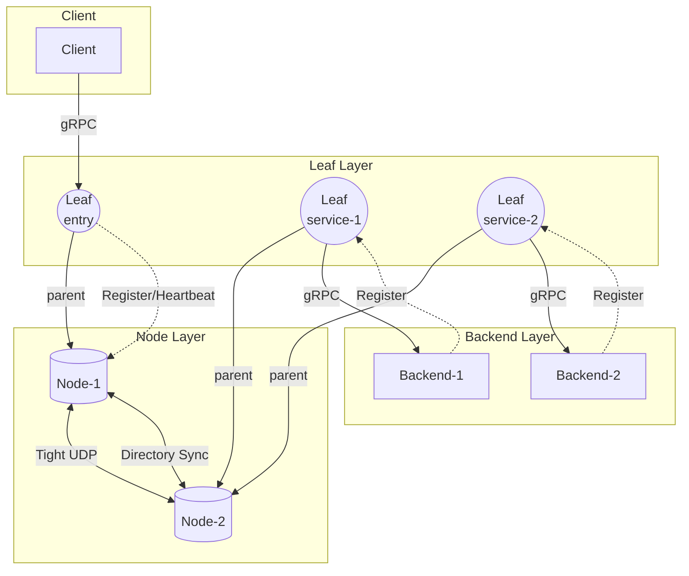
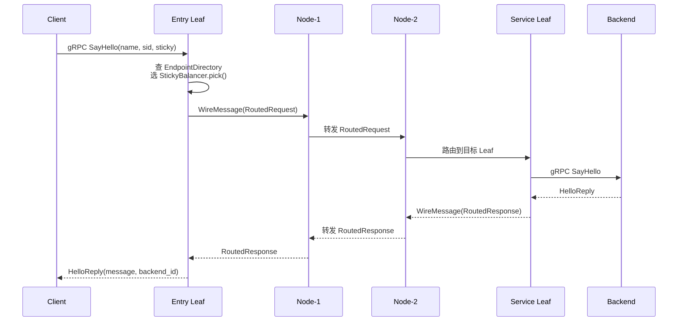
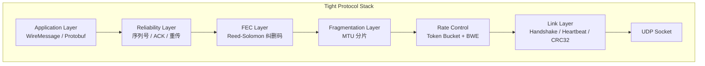
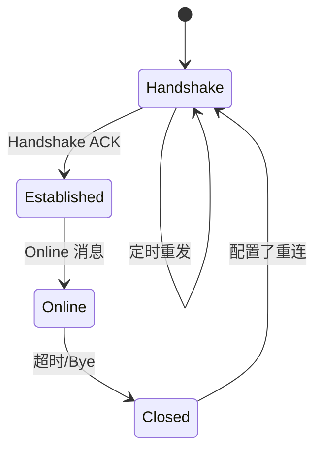
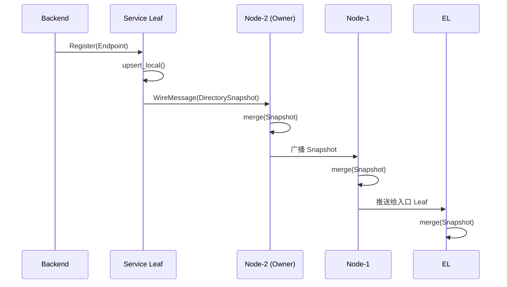
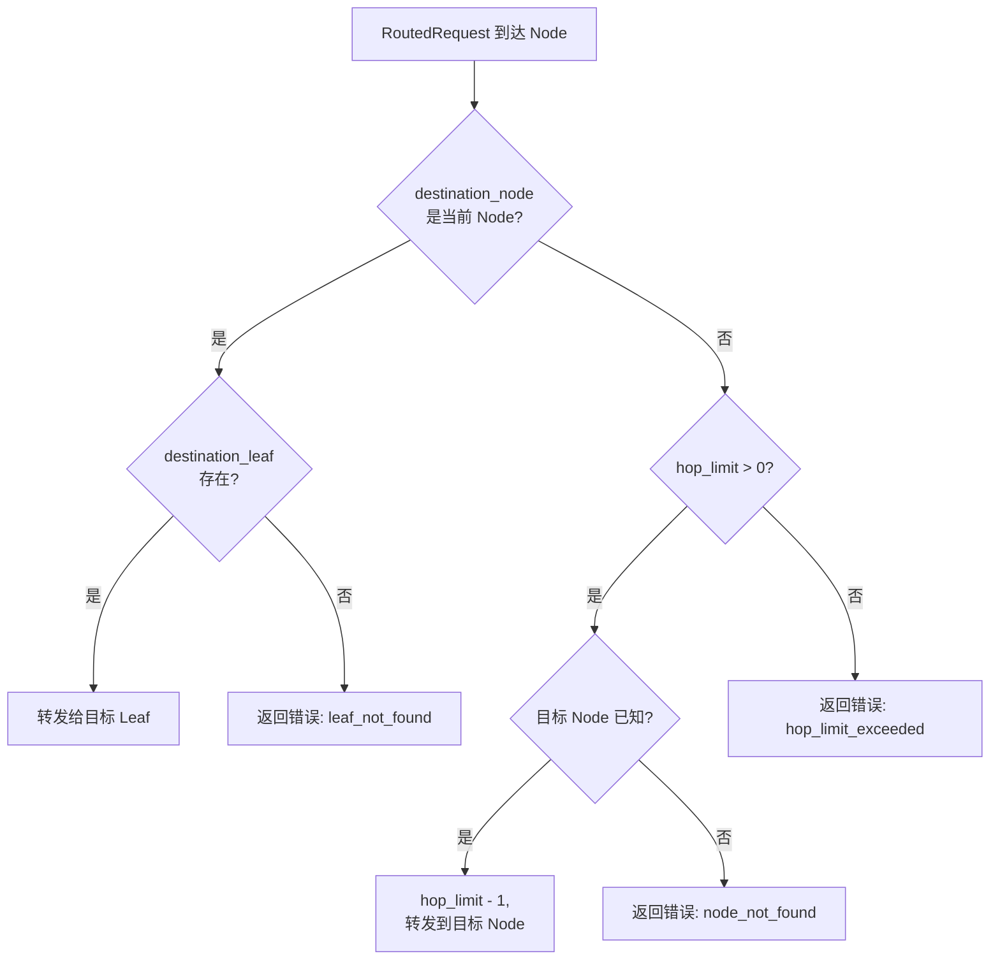

# Creek 架构设计

## 1. 总体架构

Creek 是一个两层 Sidecar 服务网格：

- **Node**：组成全网状（full mesh）拓扑，负责跨节点路由与目录同步
- **Leaf**：叶子节点，挂载到某一个 Node，提供 gRPC / JSON-RPC 业务入口



核心数据流：



## 2. Leaf / Node 角色

### Node (NodeRuntime)

Node 维护全网状连接，负责：

- 与其他 Node 建立 Tight UDP 连接
- 接收并合并 Leaf 上报的 `DirectorySnapshot`
- 在同行 Node 之间广播目录变更
- 将 `RoutedRequest` 正确路由到目标 Leaf 或转发到其他 Node
- 支持可选的 Redis 服务发现

**关键配置 (`NodeConfig`)**：

| 字段 | 说明 |
|---|---|
| `id` | Node 唯一标识 |
| `udp_bind` | Tight 协议 UDP 绑定地址 |
| `peers` | 对等 Node 列表 (id@host:port) |
| `metrics_bind` | Metrics HTTP 服务地址 |
| `sync_interval` | 目录广播周期（默认 15s） |
| `metric_period` | 指标轮转周期（默认 60s） |
| `redis` | Redis 服务发现选项（可选） |

### Leaf (LeafRuntime)

Leaf 作为业务接入层，负责：

- 通过 Tight UDP 连接父 Node
- 启动 gRPC Server 提供 `Greeter` / `LeafControl` / `Admin` 服务
- 管理本地 Backend 的注册、心跳与注销
- 提供 JSON-RPC HTTP 服务入口
- `EndpointDirectory` 本地缓存全集群端点
- 使用 `StickyBalancer` 选择目标 Backend

**关键配置 (`LeafConfig`)**：

| 字段 | 说明 |
|---|---|
| `id` | Leaf 唯一标识 |
| `udp_bind` | Tight 协议 UDP 绑定地址 |
| `parent` | 父 Node 的 id@host:port |
| `grpc_bind` | gRPC 服务地址 |
| `json_bind` | JSON-RPC HTTP 服务地址 |
| `metrics_bind` | Metrics HTTP 地址 |
| `backend_timeout` | Backend gRPC 超时（默认 3s） |
| `rpc_timeout` | 跨节点 RPC 超时（默认 15s） |

## 3. Tight 传输协议

Tight 是 Creek 自研的基于 UDP 的可靠传输协议，专为服务网格内的高吞吐、低延迟通信设计。

### 协议栈



### 数据包格式

```
 0                   1                   2                   3
 0 1 2 3 4 5 6 7 8 9 0 1 2 3 4 5 6 7 8 9 0 1 2 3 4 5 6 7 8 9 0 1
+-+-+-+-+-+-+-+-+-+-+-+-+-+-+-+-+-+-+-+-+-+-+-+-+-+-+-+-+-+-+-+-+
|                         Magic (0x54474854)                     |
+-+-+-+-+-+-+-+-+-+-+-+-+-+-+-+-+-+-+-+-+-+-+-+-+-+-+-+-+-+-+-+-+
| Version |  Type  |               Flags                         |
+-+-+-+-+-+-+-+-+-+-+-+-+-+-+-+-+-+-+-+-+-+-+-+-+-+-+-+-+-+-+-+-+
|                           Client ID                            |
+-+-+-+-+-+-+-+-+-+-+-+-+-+-+-+-+-+-+-+-+-+-+-+-+-+-+-+-+-+-+-+-+
|                          Session ID                            |
+-+-+-+-+-+-+-+-+-+-+-+-+-+-+-+-+-+-+-+-+-+-+-+-+-+-+-+-+-+-+-+-+
|                          Sequence                              |
+-+-+-+-+-+-+-+-+-+-+-+-+-+-+-+-+-+-+-+-+-+-+-+-+-+-+-+-+-+-+-+-+
|                        Acknowledgment                          |
+-+-+-+-+-+-+-+-+-+-+-+-+-+-+-+-+-+-+-+-+-+-+-+-+-+-+-+-+-+-+-+-+
|                          Message ID                            |
+-+-+-+-+-+-+-+-+-+-+-+-+-+-+-+-+-+-+-+-+-+-+-+-+-+-+-+-+-+-+-+-+
|  Fragment Index |  Fragment Count|  Payload Size |   Reserved   |
+-+-+-+-+-+-+-+-+-+-+-+-+-+-+-+-+-+-+-+-+-+-+-+-+-+-+-+-+-+-+-+-+
|                            Tick                                |
+-+-+-+-+-+-+-+-+-+-+-+-+-+-+-+-+-+-+-+-+-+-+-+-+-+-+-+-+-+-+-+-+
|                           Checksum                             |
+-+-+-+-+-+-+-+-+-+-+-+-+-+-+-+-+-+-+-+-+-+-+-+-+-+-+-+-+-+-+-+-+
|                         Payload ...                            |
+-+-+-+-+-+-+-+-+-+-+-+-+-+-+-+-+-+-+-+-+-+-+-+-+-+-+-+-+-+-+-+-+
```

总头部大小：**48 字节**，网络字节序。

### 包类型

| 类型 | 值 | 说明 |
|---|---|---|
| `Handshake` | 1 | 握手请求，携带角色和 Token |
| `HandshakeAck` | 2 | 握手确认 |
| `Online` | 3 | 链路就绪 |
| `Heartbeat` | 4 | 保活心跳 |
| `Bye` | 5 | 优雅关闭 |
| `Data` | 6 | 数据分片 |
| `Ack` | 7 | 确认 |
| `Parity` | 8 | FEC 奇偶校验分片 |

### 关键机制

**链路状态机：**



**FEC 纠删码：**

每个消息被分为 N-1 个数据分片和 1 个奇偶校验分片。任意丢失一个分片可通过 Reed-Solomon XOR 恢复。

**Token Bucket 速率控制：**

发送端使用令牌桶 + 带宽估算 (BandwidthEstimator) 动态调整发送速率，基于 ACK 的字节数和 RTT 估算可用带宽。

**CRC32 校验：**

所有数据包末尾附 CRC32 校验和，用以检测传输错误。

### WireMessage

Tight 协议的上层载荷为 Protobuf 编码的 ` WireMessage`：

```protobuf
message WireMessage {
  oneof body {
    DirectorySnapshot directory = 1;  // 目录同步
    RoutedRequest request = 2;        // 跨节点 RPC 请求
    RoutedResponse response = 3;      // 跨节点 RPC 响应
  }
}
```

## 4. 目录同步 (Directory Sync)

`EndpointDirectory` 是全局服务发现的数据结构，存储所有活跃 Backend 的注册信息。

### 数据模型

```protobuf
message Endpoint {
  string endpoint_id = 1;   // 唯一标识
  string service = 2;        // 服务名（如 creek.v1.Greeter）
  string owner_leaf = 3;     // 所属 Leaf ID
  string owner_node = 4;     // 所属 Node ID
  string target = 5;         // Backend 地址 host:port
  uint64 version = 6;        // 版本号（冲突解决）
  uint64 updated_ms = 7;     // 更新时间戳
  bool alive = 8;            // 存活标记
}

message DirectorySnapshot {
  string source_id = 1;
  uint64 version = 2;
  uint64 generated_ms = 3;
  repeated Endpoint endpoints = 4;
}
```

### 冲突解决

Endpoint 合并采用 **Last-Write-Wins** 策略，以 `version` 为主键、`updated_ms` 为副键：

1. 若新版本号 > 本地版本号 → 覆盖
2. 若版本号相同但时间戳更新 → 覆盖
3. 否则忽略

### 同步流程



## 5. 路由 (Routing)

### RoutedRequest / RoutedResponse

跨节点 RPC 通过 Node Mesh 转发：

```protobuf
message RoutedRequest {
  string request_id = 1;
  string origin_leaf = 2;
  string origin_node = 3;
  string destination_leaf = 4;
  string destination_node = 5;
  string endpoint_id = 6;
  string rpc_name = 7;
  map<string, string> metadata = 8;
  bytes body = 9;
  uint64 deadline_ms = 10;
  uint32 hop_limit = 11;     // 默认 16
}
```

### 路由逻辑



## 6. 粘性负载均衡 (StickyBalancer)

`StickyBalancer` 实现基于 `sid`（Session ID）的会话粘性路由。

### 算法

1. 从请求 Metadata 中提取 `sticky`（bool）和 `sid`（string）
2. 若非粘性请求 → 轮询选择
3. 若粘性请求：
   - 构造键 `service|sid`
   - 查找 LRU 缓存中的绑定关系
   - 命中且目标存活 → 返回
   - 未命中或目标离线 → 重新轮询选择并更新绑定

### 缓存管理

- 容量默认 4096 条
- TTL 默认 1 分钟
- 超过 TTL 未访问的条目进入 LRU 淘汰
- 调用 `invalidate()` 主动清除失败的绑定

```mermaid
flowchart TD
    PICK[pick(service, metadata)]
    SHARD{有 shard_key?}
    HASH[shard_key 哈希<br/>选固定 endpoint]
    STICKY{sticky?}
    HAS_SID{有 sid?}
    CACHED{缓存命中?}
    ALIVE{目标存活?}
    RR[轮询选择]
    REBIND[重新绑定]
    RET[返回 Endpoint]

    PICK --> SHARD
    SHARD -->|是| HASH
    SHARD -->|否| STICKY
    HASH --> RET
    STICKY -->|否| RR
    STICKY -->|是| HAS_SID
    HAS_SID -->|否| RR
    HAS_SID -->|是| CACHED
    CACHED -->|是| ALIVE
    CACHED -->|否| REBIND
    ALIVE -->|是| RET
    ALIVE -->|否| REBIND
    RR --> RET
    REBIND --> RET
```
