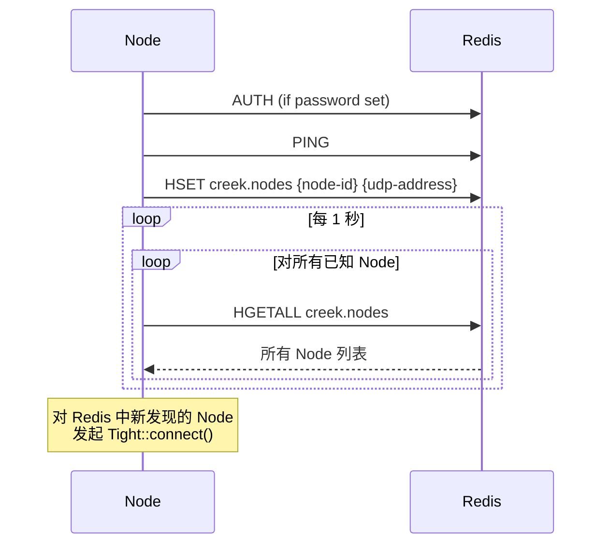
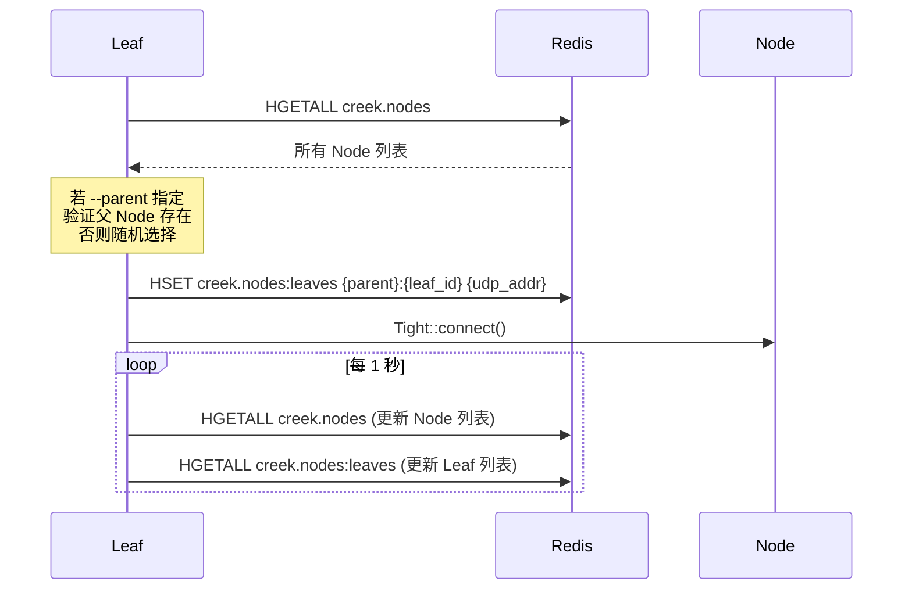

# Creek Redis 服务发现

Creek 支持通过 Redis Hash 结构实现 Node 和 Leaf 的服务发现与自动拓扑建立。启用 Redis 后，Node 和 Leaf 无需手动配置 `--peer` 即可通过 Redis 互相发现对方地址。

## 配置方式

通过命令行参数（`creek_sidecar`）传入 Redis 连接信息：

```bash
creek_sidecar node --id node-1 --udp 127.0.0.1:10000 \
    --redis-host 127.0.0.1 \
    --redis-port 6379 \
    --redis-password mypassword \
    --redis-key creek.nodes \
    --token my-cluster-token
```

| 参数 | 说明 | 默认值 |
|---|---|---|
| `--redis-host` | Redis 主机地址 | (必填) |
| `--redis-port` | Redis 端口 | (必填) |
| `--redis-user` | Redis ACL 用户名（可选） | (空) |
| `--redis-password` | Redis 密码 | (空) |
| `--redis-key` | Redis 主 Hash Key 前缀 | `creek.nodes` |

当同时指定 `--redis-host`、`--redis-port` 和 `--redis-key` 时，Redis 服务发现生效。

## Redis 数据结构

### Node 注册 Hash

**Key：** `{redis-key}`（默认 `creek.nodes`）

**结构：**

```
HSET creek.nodes {node-id} {listen_address}
```

**示例：**

```
HSET creek.nodes node-1 127.0.0.1:10000
HSET creek.nodes node-2 127.0.0.1:10001
```

查询：

```bash
redis-cli HGETALL creek.nodes
# 1) "node-1"
# 2) "127.0.0.1:10000"
# 3) "node-2"
# 4) "127.0.0.1:10001"
```

### Leaf 注册 Hash

**Key：** `{redis-key}:leaves`（默认 `creek.nodes:leaves`）

**Field 格式：** `{parent_node_id}:{leaf_id}`

**Value：** `{leaf_udp_address}`

**示例：**

```
HSET creek.nodes:leaves node-1:client-leaf 127.0.0.1:10002
HSET creek.nodes:leaves node-2:service-leaf-1 127.0.0.1:10003
HSET creek.nodes:leaves node-2:service-leaf-2 127.0.0.1:10004
```

查询所有 Leaf：

```bash
redis-cli HGETALL creek.nodes:leaves
# 1) "node-1:client-leaf"
# 2) "127.0.0.1:10002"
# 3) "node-2:service-leaf-1"
# 4) "127.0.0.1:10003"
# 5) "node-2:service-leaf-2"
# 6) "127.0.0.1:10004"
```

查询特定 Node 下的 Leaf：

```bash
redis-cli --scan --pattern "node-2:*"
# 或者遍历 HGETALL 后筛选前缀为 "node-2:" 的 Key
```

## Node 注册流程



1. Node 启动时，若配置了 Redis，立即执行 `HSET {key} {id} {udp_addr}` 注册自身
2. `redis_sync_loop` 线程每 1 秒轮询 `HGETALL {key}` 获取所有 Node
3. 对未建立连接的 Node，自动调用 `transport_->connect({id, address})`

## Leaf 注册流程



1. Leaf 启动时，先通过 `HGETALL {key}` 发现活跃 Node
2. 若 `--parent` 指定了目标 Node ID，验证该 Node 已在 Redis 中注册，否则抛异常
3. 若未指定 `--parent`，从 Redis 返回的 Node 列表中随机选择一个
4. 确认父 Node 后，执行 `HSET {key}:leaves {parent_id}:{leaf_id} {udp_addr}` 注册
5. 启动 Tight 连接到父 Node

## 重新注册与租约续期

`RedisClient` 提供 `lease_renew()` 方法，由内部的同步循环定时调用：

- **Node 模式**：周期性 `HSET {key} {id} {address}` 刷新自身注册
- **Leaf 模式**：周期性 `HSET {key}:leaves {parent}:{leaf_id} {address}` 刷新

若 Redis 连接断开，`ensure_locked_()` 会自动重连。

## 完整示例

使用 Redis 服务发现启动双 Node 集群：

```bash
# 终端 1 - Node-1
creek_sidecar node \
    --id node-1 \
    --udp 127.0.0.1:10000 \
    --metrics 127.0.0.1:20001 \
    --token my-token \
    --redis-host 127.0.0.1 \
    --redis-port 6379 \
    --redis-password creekredis \
    --redis-key creek.nodes

# 终端 2 - Node-2（无需 --peer）
creek_sidecar node \
    --id node-2 \
    --udp 127.0.0.1:10001 \
    --metrics 127.0.0.1:20002 \
    --token my-token \
    --redis-host 127.0.0.1 \
    --redis-port 6379 \
    --redis-password creekredis \
    --redis-key creek.nodes

# 终端 3 - Leaf（自动选择父 Node）
creek_sidecar leaf \
    --id my-leaf \
    --udp 127.0.0.1:10002 \
    --grpc 127.0.0.1:9000 \
    --token my-token \
    --redis-host 127.0.0.1 \
    --redis-port 6379 \
    --redis-password creekredis \
    --redis-key creek.nodes
```

此时 `creek.nodes` 中的内容：

```
node-1  127.0.0.1:10000
node-2  127.0.0.1:10001
```

`creek.nodes:leaves` 中的内容：

```
node-1:my-leaf  127.0.0.1:10002
```

## API 参考

`RedisClient` 类 (`include/creek/redis.hpp`)：

| 方法 | 说明 |
|---|---|
| `RedisClient(options, self_id)` | 构造并连接 |
| `ping()` | 发送 PING 命令 |
| `health_ok()` | 健康检查（等价 ping） |
| `is_connected()` | 检查连接状态 |
| `register_node(address)` | `HSET {key} {id} {address}` |
| `register_leaf(address, parent_id)` | `HSET {key}:leaves {parent}:{id} {address}` |
| `fetch_nodes()` | `HGETALL {key}` |
| `fetch_leaves_for_node(node_id)` | 按 `{node_id}:*` 前缀过滤 `HGETALL` |
| `hget(hash_key, field)` | 通用 HGET |
| `hdel(hash_key, field)` | 通用 HDEL |
| `lease_renew()` | 刷新注册信息 |

**Redis AUTH 流程：**

```cpp
// 源码路径：src/redis.cpp
if (!options_.password.empty()) {
    redisCommand(c,
        !options_.user.empty()
            ? "AUTH %s %s"   // Redis 6+ ACL: AUTH username password
            : "AUTH %s"      // 传统: AUTH password
    );
}
```
