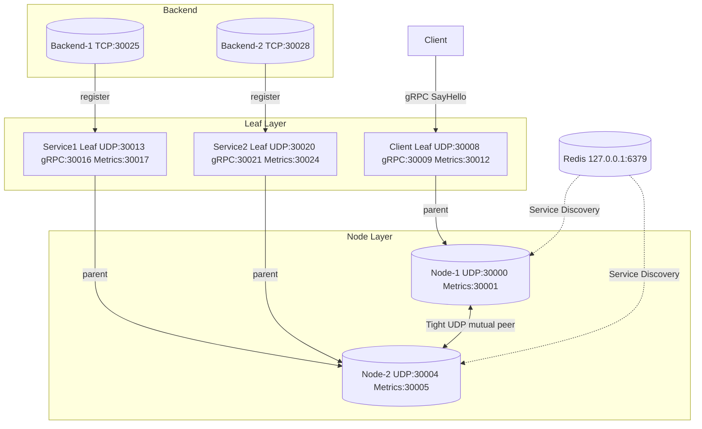

# Creek 测试架构

## 测试概览

Creek 的测试分为三个层级：

| 层级 | 类别 | 框架 | 说明 |
|---|---|---|---|
| 单元测试 | `creek_tight_test` | 自实现宏 | 传输协议：编码/解码/CRC/FEC/BWE/握手 |
| 单元测试 | `creek_routing_metrics_test` | 自实现宏 | 目录合并、粘性路由、指标旋转 |
| 单元测试 | `creek_wasm_test` | 自实现宏 | WASM 模块加载、沙箱执行、热替换 |
| E2E 集成 | `creek_e2e_2node` | GTest | 2 Node 完整拓扑 + Redis |
| E2E 集成 | `creek_e2e` | Python (pytest) | Python 驱动的全流程 E2E |
| 集成测试 | `creek_redis_discovery_e2e` | GTest | Redis 服务发现专用测试 |

## ctest 列表

```bash
ctest --test-dir build -N
```

输出：

```
Test #1:  creek_tight_test
Test #2:  creek_routing_metrics_test
Test #3:  creek_e2e_2node
Test #4:  creek_redis_discovery_e2e
Test #5:  creek_e2e
Test #6:  creek_wasm_test
```

### 测试详情

#### 1. creek_tight_test

**源文件：** `tests/tight_test.cpp`

| 测试用例 | 说明 |
|---|---|
| `test_packet_codec_roundtrip` | 编码/解码往返：空载荷、大载荷、边界 |
| `test_crc_corruption` | CRC32 校验：数据篡改、头部损坏、截断、magic/版本错误 |
| `test_fec_recovery` | Reed-Solomon FEC 恢复：偶数分片、不均等分片 |
| `test_bandwidth_estimator` | 带宽估算器：基本估算、零值保护、RTT 平滑 |
| `test_two_transport_handshake_and_big_message` | 双传输握手 + 50000 字节大消息往返 |
| `test_token_mismatch_blocks_handshake` | Token 不匹配阻止握手连接 |

```bash
ctest --test-dir build -R creek_tight_test -V
```

#### 2. creek_routing_metrics_test

**源文件：** `tests/routing_metrics_test.cpp`

| 测试用例 | 说明 |
|---|---|
| `test_directory_conflict` | 目录版本冲突解决（version/updated_ms 比较） |
| `test_sticky_basic` | 粘性路由：同一 sid 重复命中、非粘性轮询、空 endpoint |
| `test_sticky_timeout` | 粘性 TTL 超时：超时后重新分配 |
| `test_sticky_offline` | 目标离线自动切换 + invalidate |
| `test_minute_rotation` | 指标分钟轮转：previous/current 窗口 |
| `test_take_clear` | take 操作清空累计值 |
| `test_openmetrics_and_json` | OpenMetrics 和 JSON 格式输出验证 |

```bash
ctest --test-dir build -R creek_routing_metrics_test -V
```

#### 3. creek_e2e_2node

**源文件：** `tests/e2e_2node_test.cpp`, `tests/e2e_2node_main.cpp`

基于 GTest 的完整 E2E 测试，通过 Windows CreateProcess 启动所有子进程。

**前置条件：**
- `CREEK_SIDECAR`、`CREEK_HELLO_SERVER`、`CREEK_HELLO_CLIENT` 环境变量（CMake 自动设置）
- 运行中的 Redis 实例（通过 `CREEK_REDIS_*` 环境变量配置）

```bash
ctest --test-dir build -R creek_e2e_2node -V
```

**属性：**
- `TIMEOUT 180`：超时 180 秒
- `RUN_SERIAL TRUE`：串行执行
- `ENVIRONMENT PATH`：包含 `build/bin` 和 MSYS2 bin

#### 4. creek_redis_discovery_e2e

**源文件：** `tests/integration/redis_discovery_e2e.cpp`

通过 PowerShell 脚本 `tools/redis_e2e.ps1` 启动的 Redis 服务发现集成测试。

```bash
ctest --test-dir build -R creek_redis_discovery_e2e -V
```

#### 5. creek_e2e

**源文件：** `tests/e2e/e2e.py`

Python 驱动的 E2E 测试，使用 `subprocess` 管理进程、`socket` 进行端口检测和 HTTP 交互。E2E 覆盖 gRPC 与 JSON-RPC 双模式入口，验证跨协议一致性。

```bash
ctest --test-dir build -R creek_e2e -V
```

#### 6. creek_wasm_test

**源文件：** `tests/wasm_test.cpp`

验证 WASM 模块的加载、沙箱执行与热替换 (RCU swap) 流程。

| 测试用例 | 说明 |
|---|---|
| `test_wasm_load_and_call` | WASM 模块加载并调用导出函数 |
| `test_wasm_sandbox_isolation` | WASM 沙箱隔离：内存越界、非法指令保护 |
| `test_wasm_hot_reload` | 热替换：新旧模块并行、旧模块引用计数归零后释放 |

```bash
ctest --test-dir build -R creek_wasm_test -V
```

### 管理工具

`creek_admin_client` 是命令行管理工具，通过 gRPC 连接 Leaf 的 Admin 服务，支持远程推送 WASM 模块、管理路由规则和查询路由表。E2E 测试包含 admin_client 的端到端验证：推送 WASM → 规则生效 → 请求命中自定义逻辑。

## E2E 拓扑说明

### 双 Node 拓扑（creek_e2e_2node）



**端口分配（固定）：**

| 组件 | UDP | gRPC/Backend | Metrics |
|---|---|---|---|
| node1 | 30000 | - | 30001 |
| node2 | 30004 | - | 30005 |
| client_leaf | 30008 | 30009 | 30012 |
| service1_leaf | 30013 | 30016 | 30017 |
| service2_leaf | 30020 | 30021 | 30024 |
| backend1 | - | 30025 | - |
| backend2 | - | 30028 | - |

### E2E 测试阶段

```
PHASE 1  nodes registered       -- 启动两个 Node 并在 Redis 中注册
PHASE 2  service discovery      -- 等待 Backend 注册传播到客户端 Leaf
PHASE 3  sticky sid=1           -- 10 次粘性调用必须命中同一 Backend
PHASE 4  kill backend           -- 杀掉命中的 Backend
PHASE 5  failover               -- 等待自动切换到另一 Backend
```

### Python E2E 拓扑（creek_e2e）

与上述拓扑类似，但端口由 `available_port()` 动态分配（随机端口），增加了：

- **JSON-RPC 验证**：通过 HTTP POST 调用 JSON-RPC SayHello
- **Metrics Stats 验证**：验证 `/stats?previous=1` 和 `/stats?take=1` 的行为

测试阶段：

```
1. 分配动态端口
2. 启动 node-1、node-2（节点间通过 --peer 互联）
3. 启动 entry_leaf、service_leaf1、service_leaf2
4. 等待所有 Leaf gRPC 就绪
5. 启动 backend-1（挂 service_leaf1）、backend-2（挂 service_leaf2）
6. 验证服务发现收敛
7. 粘性调用 10 次验证同 Backend
8. kill 命中的 Backend
9. 等待故障转移完成
10. 验证 /stats JSON 指标
11. 验证 JSON-RPC 入口
```

## 运行所有测试

```bash
# 串行运行（E2E 测试互相冲突）
ctest --test-dir build -j1 -V

# 仅运行单元测试（可并行）
ctest --test-dir build -R "tight|routing_metrics" -j4 -V

# 仅运行 E2E 测试
ctest --test-dir build -R "e2e" -j1 -V
```

## 调试 E2E 日志

E2E 测试将日志输出到指定目录：

- `CREEK_E2E_LOG_DIR` 环境变量（默认 `D:\vit\creek\tests\e2e-logs`）
- 每个子进程有独立的 `.log` 和 `.err` 文件
- `e2e-run.log` 包含测试框架本身的阶段日志

查看日志：

```bash
ls tests/e2e-logs/
# node1.log  node1.err  node2.log  node2.err
# client_leaf.log  client_leaf.err
# service1_leaf.log  service1_leaf.err
# service2_leaf.log  service2_leaf.err
# backend1.log  backend1.err
# backend2.log  backend2.err
# e2e-run.log
```

## 添加新测试

### 单元测试

在 `tests/` 下添加 `*.cpp` 文件。CMake 自动将 `tests/*.cpp` 和 `tests/unit/*.cpp` 作为单元测试编译（排除 `e2e_*` 前缀文件）。

单元测试无需 GTest 依赖，使用 `CHECK` 宏验证条件：

```cpp
#define CHECK(cond) do { \
    ++tests; \
    if (!(cond)) { \
        std::cerr << "FAIL: " << #cond << "\n"; \
        ++failures; \
    } \
} while (0)
```

### E2E 集成测试

在 `CMakeLists.txt` 中添加：

```cmake
add_executable(creek_my_e2e tests/my_e2e_test.cpp tests/my_e2e_main.cpp)
target_link_libraries(creek_my_e2e PRIVATE creek_core GTest::gtest_main)
add_test(NAME creek_my_e2e COMMAND "$<TARGET_FILE:creek_my_e2e>")
set_tests_properties(creek_my_e2e PROPERTIES
    TIMEOUT 120
    RUN_SERIAL TRUE
    ENVIRONMENT "CREEK_SIDECAR=$<TARGET_FILE:creek_sidecar>"
    ENVIRONMENT "CREEK_HELLO_SERVER=$<TARGET_FILE:creek_hello_server>"
    ENVIRONMENT "CREEK_HELLO_CLIENT=$<TARGET_FILE:creek_hello_client>"
)
```

### 测试辅助脚本

`tools/` 目录下的 PowerShell 脚本可直接执行 E2E 测试：

```powershell
# 2 Node E2E（需要先编译）
powershell -File tools\e2e_2node.ps1 \
    -SidecarExe build\bin\creek_sidecar.exe \
    -HelloServerExe build\bin\creek_hello_server.exe \
    -HelloClientExe build\bin\creek_hello_client.exe

# Redis E2E
powershell -File tools\redis_e2e.ps1 \
    -SidecarExe build\bin\creek_sidecar.exe \
    -HelloServerExe build\bin\creek_hello_server.exe \
    -HelloClientExe build\bin\creek_hello_client.exe
```
